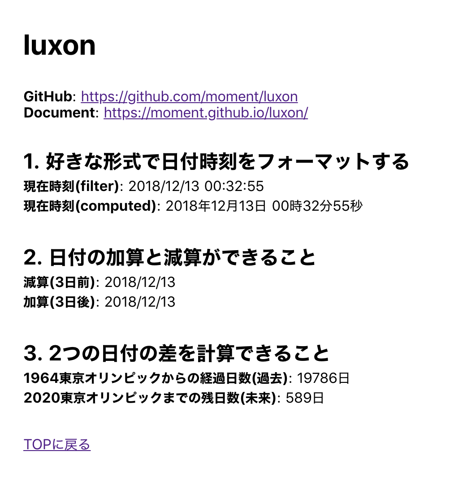

# PAGES

## index.vue
  
url: http://localhost:3000/

## sample/moment.vue
  
url: http://localhost:3000/sample/moment/

## sample/dayjs.vue
  
url: http://localhost:3000/sample/dayjs/

## sample/date-fns.vue
  
url: http://localhost:3000/sample/date-fns/

## sample/luxon.vue
  
url: http://localhost:3000/sample/luxon/
